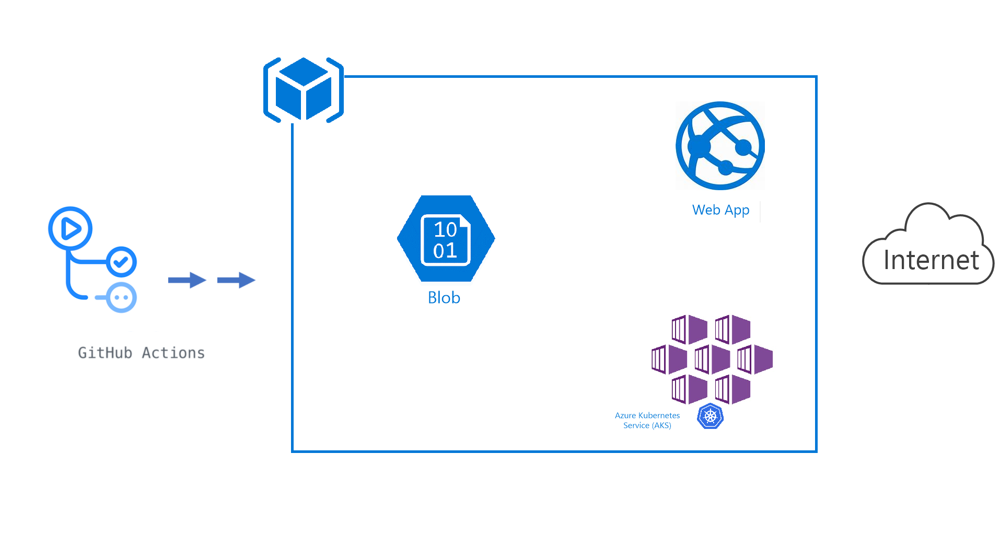
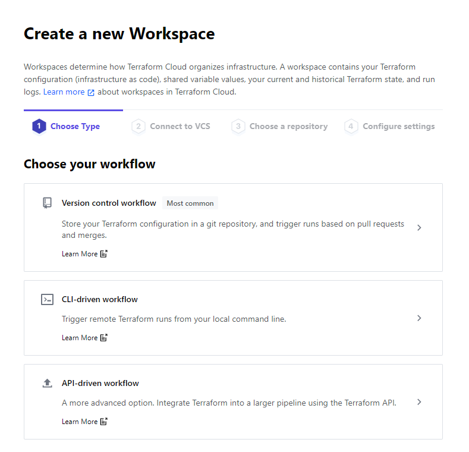

# VulnerableAzure
Terraform playbook of a vulnerable Azure deployment

Written by Michael Braun

<p align="left">
    
</p>    


The purpose of this project is to build an intentionally vulnerable environment for me to experiement with. I see this as having two main purposes. <br>

1. Test offensive principles and tools against vulnerable Azure infrastructure. The vulnerabilities are very obvious, because I wanted the focus to be on the Azure infrastructure and not the web applications.

2. Test defensive tools to evaluate their capabilities in the Cloud and the CI/CD pipeline.

This is a first version, as it was also a way for me to learn about Azure, Terraform and Github Actions. I will refine this as I learn more about all of these services. 

Here is crude diagram of what this playbook will build:



All services are open and accessible to the internet.

<b> DO NOT DEPLOY THIS IN A PRODUCTION ENVIRONMENT </b>

Finally, because this uses Github Actions as a CI/CD delivery tool, <b>every commit will run the Github Action</b>

## Prerequisites

[Github Account](https://github.com) <br>
[Azure Account](https://portal.azure.com) <br>
[Terraform Cloud Account](https://terraform.io) <br>

This writeup assumes that you have basic working knowledge of all of these services. 

## Setup 

Fork the [VulnerableAzure](https://github.com/metalstormbass/VulnerableAzure) repository into your personal Github account. 
<br>

### Microsoft Azure
 Create an App Registration in Azure. As this will be used multiple times, please note the following:

- Application (client) ID
- Directory (tenant) ID
- Secret
- Subscription ID

Ensure that you give this app registration "Contributor" permission. This is required for Terraform to build the environment.

### Terraform
Terraform Cloud is being used to host the variables and the state file. The actual run occurs in Github Actions.

Create a new workspace in your Orginization and select CLI-driven run. The configure your variables.



Start with the Environment Variables. Input the Azure App Registration information you noted earlier. Use the following keys.


Then fill in the variables required to run the Terraform playbook. Reuse the Azure App Registration client id and secret for the client_id and the client_secret variables.


Under the user settings, select Tokens and create an API token. Note the value for later. 

Finally, in the workspace you created, click on Settings > General Settings and note the Workspace ID. We need to this to setup the API call to Terraform.io

### Github 
Github Actions is used to 

Select settings and add the following secrets to your repository:


AZ_ID = Azure Client ID
AZ_SECRET = Azure Client Secret
AZ_TENANT =  Directory(Tenant) ID
TERRAFORM = Terraform API token, created in last step
TF_ENV = https://app.terraform.io/api/v2/workspaces/INSERT YOUR WORKSPACE ID

Click on actions and enable workflows

## Run the playbook
Since this playbook uses Github Actions to run, let's kill two birds with one stone.

Edit the [main.tf](main.tf) and insert your Terraform values

```bash
#This info is required for Github Actions to trigger the Terraform Cloud Deployment

terraform {
      backend "remote" {
         # The name of your Terraform Cloud organization.
         organization = ENTER YOUR TERRAFORM ORGANIZATION HERE WITH QUOTES

         # The name of the Terraform Cloud workspace to store Terraform state files in.
         workspaces {
           name = ENTER YOUR TERRRAFORM WORKSPACE HERE WITH QUOTES
         }
       }
     }
```
Once you commit the change, the Github Action will start running immediately. Click on the action tab, open the latest run and watch the progress.

The output information for your environment will be located under the Terraform Apply section. Scroll down to the bottom to see it.


You're now finished and ready to start testing!

## Destruction

In order to destroy this deployment, go to your Terraform Cloud workspace and click on Settings>Destructions & Deletion> Destroy Environment.


## Offensive Scenarios

There are three basic scenarios to test from an offensive perspective:

1. Use enumeration to find the publically accessible Blob storage. Locate the "personal information"
2. Exploit the web application that runs on the Kubernetes Cluster
3. Enumerate and exploit the web application that runs on App Services

Once you have done the basics, see how far you can go. I'm still researching what you can do once you have an initial foothold.

## Defensive Scenarios

For defenders, I would suggest examinng the deployment and performing a Threat Modelling exercise. Once you understand the risks, see what options you have to mitgate them. 


